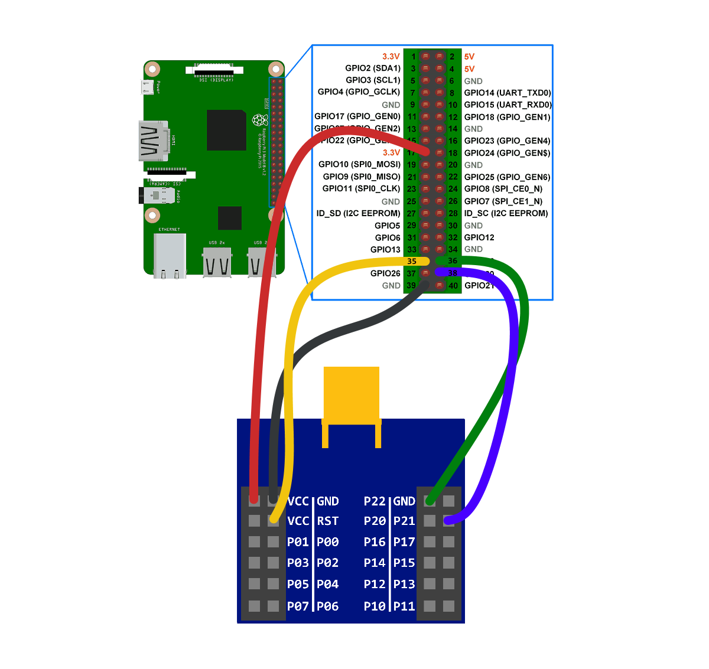

# Прошивка CC2530 через Raspberry Pi

За основу взята статья [Прошивка CC2530 через Raspberry Pi](https://kvvhost.ru/2020/07/17/flashing-cc2530-raspberry-pi/)

> **ⓘ**
>
> Перед тем, как приступить к подключению, необходимо освободить от консольного вывода аппаратный UART. Для этого удаляем записи `console=serial0,115200 console=tty1` из файла `cmdline.txt` расположенного на SD-карте с образом raspbian.

Команда

~~~
# apt-get install wiringpi
~~~

Не работает. Возвращает ошибку

~~~
E:  Package 'wiringpi:armhf' has no installation candidate
~~~

[Решение](https://raspberrypi.ru/578-wiring-pi-biblioteka-raboty-s-gpio-chast-1) - установка из исходников:

~~~
$ git clone --depth 1 https://github.com/WiringPi/WiringPi.git
$ cd ./WiringPi
$ ./build
$ cd ..
~~~

Далее скачиваем утилиту flash_cc2531 и пересобираем:

~~~
$ git clone --depth 1 https://github.com/jmichault/flash_cc2531.git
$ cd ./flash_cc2531
$ make all
$ ./cc_chipid
~~~

Пересборка нужна т.к. мы работем с 64-битной версией ОС. Если при этом ПП подключена, как на картинке, , то в ответе мы получим идентификатор чипа:

~~~
  ID = a524.
~~~

Назначение сигналов:

| Сигнал | пин CC2530 | пин Raspberry | GPIO number |
|--------|------------|---------------|-------------|
| +3.3v  | VCC        | 1 (or 17)     | 3.3V        |
| GND    | GND        | 39            | GND         |
| RST    | RST        | 35            | GPIO19      |
| DC     | P22        | 36            | GPIO16      |
| DD     | P21        | 38            | GPIO20      |

Скачиваем и устанавливаем прошивку:

~~~
$ wget https://github.com/Koenkk/Z-Stack-firmware/raw/master/coordinator/Z-Stack_Home_1.2/bin/default/CC2530_DEFAULT_20211115.zip
$ unzip -a CC2530_DEFAULT_20211115.zip
$ ./cc_erase
$ ./cc_write CC2530ZNP-Prod.hex
~~~

Отсоединяем ZigBee коммутатор и подключаем его с интерфейсу USART Raspberry Pi согласно схеме:

| Сигнал | пин CC2530 | пин Raspberry | GPIO number |
|--------|------------|---------------|-------------|
| +3.3v  | VCC        | 1 (or 17)     | 3.3V        |
| GND    | GND        | 39            | GND         |
| RX     | P02        | 10            | GPIO15 (RX) |
| TX     | P03        | 8             | GPIO14 (TX) |

В конфиг [zigbee2mqtt](https://www.zigbee2mqtt.io/guide/adapters/flashing/connecting_cc2530.html) нужно добавить:

~~~
advanced:
  rtscts: false
~~~
