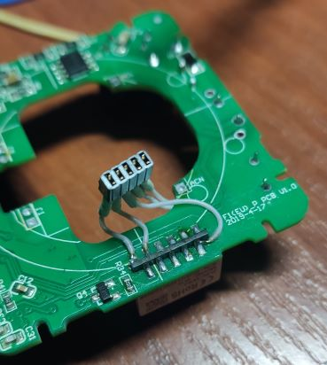

# Прошивка розетки Яндекса

Розетка яндекса основана на модуле [WR2](https://developer.tuya.com/en/docs/iot/wifiwr2module?id=K9605tko0juc3), на чипе RTL8710BN.
Для прошивки данного чипа используется проект https://docs.libretiny.eu/. Начальные сведения о процессе обновления получены [здесь](https://kazus.ru/forums/showthread.php?t=121126). Отсюда же позаимствована принципиальная схема устройства:

## Подготовка инструментов и сборка прошивки

> **ⓘ**
>
> Если вы имеете доступ к компьютеру c linux, то можно поручить сборку ему, исключив процесс настройки  ESPHome. Этот вариант рассмотрен во втором параграфе данного документа. Он много проще и требует меньше вычислительных ресурсов. Настроить ESPHome и подключить прошитые девайсы можно позже.

1. Устанавливаем дополнение ESPHome в Home Assistant через веб-интерфейс: `Настройки` -> `Дополнения` -> `Магазин дополнений` -> `ESPHome` -> `Установить`.
2. После установки в открывшемся диалоге включаем автозагрузку, watchdog и показ на боковой панели.
3. Нажимаем `Запустить`.
4. После запуска нажимаем `ESPHome` в боковой панели.
4. В появившемся интерфейсе жмем `Secrets`.
5. Прописываем логин и пароль Wi-Fi сети, к которой будем подключать девайсы:

~~~
wifi_ssid: "wifi_name"
wifi_password: "wifi_password"
~~~

6. Сохраняем файл и закрываем диалог.
7. Нажимаем `+ New device`.
8. В открывшемся диалоге - `Continue`.
9. Выбираете имя устройства и любую платформу, нажимаем `Install`.
10. Теперь в интерфейсе ESPHome появилась конфигурация нашего устройства, редактируем её под наш чип; за основу взята [инструкции](https://kazus.ru/forums/showpost.php?p=1396708&postcount=10), однако синтаксис приведенного в ней файла несколько устарел:

~~~
esphome:
  name: ya1

rtl87xx:
  board: wr2
  framework:
    version: 0.0.0
    source: https://github.com/kudesnick/libretiny

logger:
  hardware_uart: "UART2"
  level: ERROR

api:
  encryption:
    key: !secret api_key
  port: 6053

ota:
  password: !secret ota_password
  port: 8710

web_server:
  version: 2
  auth:
    username: !secret web_username
    password: !secret web_password

captive_portal:

wifi:
  ssid: !secret wifi_ssid
  password: !secret wifi_password
  ap:
    password: "WR2-RTL8710BN"
    ap_timeout: 5min
  fast_connect: on
  power_save_mode: none

switch:
  - platform: gpio
    name: "Relay"
    pin: PA00
    id: relay
    restore_mode: RESTORE_DEFAULT_OFF
light:
  - platform: status_led
    id: statusled
    pin:
      number: PA23
      inverted: true
binary_sensor:
  - platform: gpio
    pin:
      number: PA18
      inverted: true
      mode:
        input: true
        pullup: false
    filters:
      - delayed_off: 10ms
    name: "Button"
    on_click:
      - switch.toggle: relay
sensor:
  - platform: hlw8012
    model: BL0937
# Resistor values are 2M and 1K, however this value gives readings significantly higher than normal
# I calibrated this value using my official (used for billing) energy meter readings as a reference
#   voltage_divider: 2001
    voltage_divider: 1790
    sel_pin:
      number: PA15
      inverted: true
    cf_pin:
      number: PA05
      inverted: true
    cf1_pin:
      number: PA12
      inverted: true
    current:
      name: "Current"
    voltage:
      name: "Voltage"
    power:
      name: "Power"
    energy:
      name: "Energy"
    update_interval: 5s
    change_mode_every: 4
~~~

> **⚠**
>
> Обратите внимание на то, что используется кастомный репозиторий фреймворка libretiny. Это связано с некорректной настройкой GPIO. Если использовать официальный репозиторий, то прошивка не будет работать, а будет всё время перезагружаться с сообщением `W [      0.102] CHANGE interrupts not supported`.
> Это связано с [ошибкой](https://github.com/libretiny-eu/libretiny/issues/155), которую еще не поправили.

11. Сохраняем.
12. Нажимаем `Install` -> `Manual download`.
13. Ждем, пока LibreTiny поставит все зависимости и соберет прошивку.

> **ⓘ**
>
> Возможно, понадобится расширить файл подкачки до 2 GB:
> ~~~
> # sed -i "s/CONF_SWAPSIZE.*$/CONF_SWAPSIZE=1024/" "/etc/dphys-swapfile"
> ~~~

14. После успешной сбоки откроедся диалог скачивания прошивки. Выбираем для скачивания файл с расширением `*.uf2`.

## Сборка без Home Assistant

Сборка через интерфейс Home Assistant нестабильна на слабом железе. Алтернативный вариант - сборка из консоли linux. Если сборка происходит на том же устройстве, на котором уже развернуть Home Assistant, то предварительно его рекомендуется остановить, дабы высвободить ресурсы ЦП и ОЗУ:

~~~
$ ha core stop
~~~

1. Загружаем репозиторий и устанавливаем зависимости:

~~~
$ git clone https://github.com/esphome/esphome
$ cd esphome
$ pip install argcomplete voluptuous colorama platformio
~~~

2. Создаем файл с конфигурацией из инструкции выше. Обратите внимание, что ссылка `!secret` не сработает, нужно явно прописать логин и пароль от сети Wi-Fi. Сохраняем файл под именем `ya1.yml`.
3. Запускаем сборку:

~~~
$ python -m esphome compile ya1.yml
~~~

4. По окончании сборки забираем прошивку по пути `./.esphome/build/ya1/.pioenv/ya1/firmware.uf2`:

~~~
$ cp ./.esphome/build/ya1/.pioenv/ya1/firmware.uf2 ya1.uf2
~~~

Если сборка происходила на сторонней машине, то можем сразу скопировать прошивку на устройство по ssh:

~~~
$ scp ./.esphome/build/ya1/.pioenv/ya1/firmware.uf2 ${LOGIN}@${SERVER}:~/ya1.uf2
~~~

## Подготовка устройства для прошивки

1. Вскрываем устройство, отщелкнув защелки по углам корпуса (две на каждый угол).
2. Отпаиваем плату, которая держится на 6 "иголках".
3. Напаиваем разъем программирования:

4. Делаем пропилы в половинках корпуса под разъем:

5. Запаиваем плату наместо.
6. Собираем розетку:

Распиновка разъема на картинке слева направо: TX(PA30); RX(PA29); CEN; GND; +3.3v.

> **⚠ ВНИМАНИЕ! ВЫСОКОЕ НАПРЯЖЕНИЕ! ⚠**
>
> Не подключайтесь к разъему, когда розетка воткнута в сеть 220в!
> Розетка имеет бестрансформаторный источник питания. Прикосновение к контактам разъема **⚠ ОПАСНО ДЛЯ ЖИЗНИ! ⚠** Также отсутствие гальванической развязки может привести к выходу из строя оборудования, подключенного к разъему.

## Прошивка

Прошиваем согласно [официальной инструкции](https://docs.libretiny.eu/docs/platform/realtek-ambz/#partition-layout).

Отладочный UART, через который производится прошивка, не выведен на гребенку с контактами. Он представляет собой две контрольные точки, расположенные на нижней стороне платы. Точка, которая ближе к гребенке контактов - TX2. Та, что выше - RX2.

1. Устанавливаем утилиту для прошивки:

~~~
$ pip install ltchiptool
~~~

2. Подключаем модуль WR2 к Raspberry Pi по следующей схеме из [официального гайда](https://docs.libretiny.eu/docs/platform/realtek-ambz/#flashing). Обратите внимание, что для входа в режим прошивки необходимо, чтобы пин PA30(TX2) был подтянут к земле на момент снятия сигнала низкого уровня с линии RESET.

| пин RTL8710BN | сигнал WR2 | пин Raspberry | GPIO number    |
|---------------|------------|---------------|----------------|
| RESET         | CEN        | 7             | GPIO04         |
| PA29          | RX2        | 8             | GPIO14 UART TX |
| PA30          | TX2        | 10            | GPIO15 UART RX |

3. Прошиваем устройство:

~~~
$ ltchiptool flash write ya1.uf2 -d /dev/serial0
~~~

4. В случае необходимости, смотрим логи загрузки:

~~~
$ minicom -b 115200 -D /dev/serial0 -o
~~~
